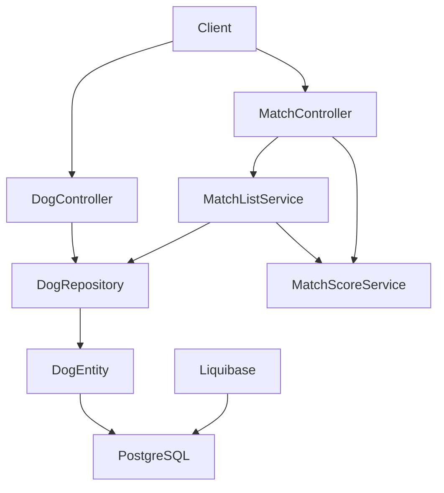
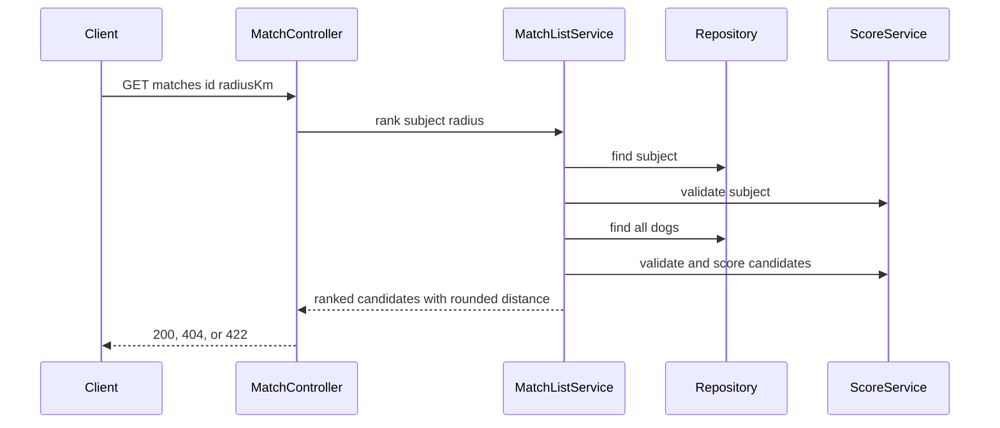
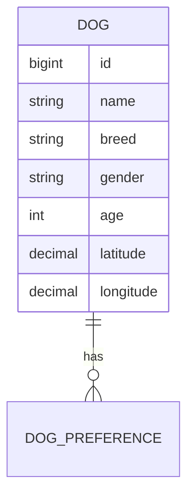
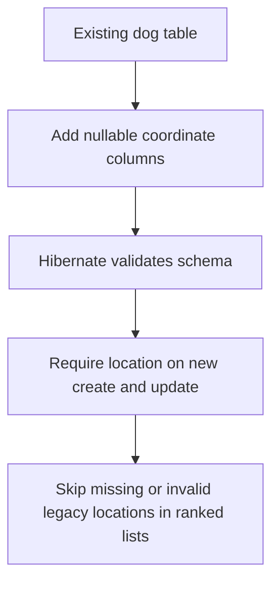

# Design Document

## Overview

This feature adds location-aware dog profiles and ranked candidate discovery to the existing tinder4dogs REST service. Dog creation and profile reads expose a complete coordinate pair, while a focused ranked-list service filters candidates by a per-request radius, preserves compatibility-score ordering, and returns privacy-preserving rounded distances.

Dog profile persistence and profile HTTP contracts remain owned by the `dog` package. Ranked selection, coordinate validation for persisted candidates, distance calculation, and score ordering are owned by the `match` package. Pairwise compatibility remains location-independent.

### Goals
- Require a valid location when creating a dog and support replacing it through a focused update endpoint.
- Filter ranked candidates by a default 25 km radius or a valid requested radius from 0 to 1000 km.
- Return candidates ordered by compatibility score with rounded distance and no exact candidate coordinates.
- Preserve legacy rows without locations and preserve pairwise lookup behavior.

### Non-Goals
- Geolocation consent or compliance workflow.
- Address geocoding.
- Search filters beyond radius.
- Generic dog-profile updates or location removal.
- Database-side geospatial search or a new geospatial dependency.

## Boundary Commitments

### This Spec Owns
- The dog profile's latitude and longitude contract for creation, reads, and location replacement.
- The `PUT /api/dogs/{id}/location` contract; it accepts a complete coordinate pair and cannot remove a location.
- The optional `radiusKm` contract on `GET /api/matches/{id}`.
- Ranked candidate filtering, great-circle distance calculation, score ordering, rounded `distanceKm`, and candidate coordinate privacy.
- The nullable legacy-data behavior for persisted dogs without valid locations.

### Out of Boundary
- Consent, privacy-policy, access/deletion-request, and location-retention workflows.
- Authentication and authorization; the current service has no user accounts.
- Pairwise compatibility calculation and its response contract, except that it must remain independent of location.
- Address lookup, map providers, PostGIS, search filters, and client presentation.
- Generic profile update or delete operations.

### Allowed Dependencies
- `dog` owns `Dog`, dog persistence, dog request/response data, and profile endpoints.
- `match` may read `DogRepository` and use `MatchScoreService`; `dog` must not depend on `match`.
- Spring MVC/Jakarta Validation, Spring Data JPA, PostgreSQL, and Liquibase already used by the service.
- Standard Kotlin/JVM math for the bounded distance calculation; no new external dependency.

### Revalidation Triggers
- Changes to dog JSON payloads, `MatchResponse`, `radiusKm`, or `distanceKm`.
- Making legacy location columns non-null or changing the handling of missing/invalid locations.
- Moving ranked selection or location ownership between `dog` and `match`.
- Introducing authentication, consent, a map provider, PostGIS, or a new geospatial library.
- Changes to the compatibility score or candidate ordering rules.

## Architecture

### Existing Architecture Analysis

The service is a single Spring Boot MVC application with package-per-concept vertical slices. `DogController` currently creates and reads `Dog` entities directly through `DogRepository`. `MatchController` currently performs ranked candidate filtering and ordering directly, while `MatchScoreService` supplies score validation and calculation. Liquibase owns the database schema and Hibernate validates it.

This design preserves the existing `dog ->` no dependency on `match` direction and moves only ranked-list orchestration into a new `MatchListService`. The pairwise handler remains location-independent.

### Architecture Pattern & Boundary Map

Selected pattern: existing vertical slices with a focused domain service. Controllers map HTTP contracts; dog owns profile storage; match owns discovery rules; repository owns persistence access.



- Existing patterns preserved: constructor injection, JPA entities, request validation, `ResponseEntity` for non-200 outcomes, append-only SQL migrations, unit-level tests.
- New components: `MatchListService` centralizes ranked-list domain rules; `Location` is a typed coordinate value used by request/response and service contracts; a location changeset extends the dog table.
- Dependency direction: request/value types and domain services are below controllers; repositories are persistence adapters; no imports from `dog` into `match` or from persistence into HTTP concerns.

### Technology Stack

| Layer | Choice / Version | Role in Feature | Notes |
|-------|------------------|-----------------|-------|
| Backend / Services | Kotlin 2.3, Spring Boot 4.1 MVC | Controllers, DTOs, validation, ranked-list service | Existing stack; no new dependency |
| Data / Storage | PostgreSQL 18, Spring Data JPA Hibernate 7 | Nullable coordinate columns on `dog` | Existing rows remain readable |
| Schema | Liquibase and plain SQL | Append-only location migration | New changeset, appended to YAML index |
| Testing | JUnit 5 and AssertJ | Unit tests for validation, distance, list behavior | Direct service construction; no database required |

## File Structure Plan

### Directory Structure

```
src/main/kotlin/com/ai4dev/tinder4dogs/
├── dog/
│   ├── Dog.kt                 # Dog entity and coordinate persistence fields
│   ├── DogController.kt       # Profile DTOs, create/read APIs, location update API
│   └── DogRepository.kt       # Existing persistence interface
└── match/
    ├── MatchController.kt     # HTTP mapping for ranked and pairwise requests
    ├── MatchListService.kt    # Ranked candidate selection and location rules
    └── MatchScoreService.kt   # Existing compatibility scoring
src/main/resources/db/changelog/
├── db.changelog-master.yaml   # Appends the location changeset
└── changes/
    └── 005-add-dog-location.sql # Adds nullable coordinate columns
src/test/kotlin/com/ai4dev/tinder4dogs/
├── dog/DogControllerTest.kt   # Dog create/read/update contract tests if controller slice is used
└── match/MatchListServiceTest.kt # Ranked filtering and distance tests
```

### Modified Files
- `src/main/kotlin/com/ai4dev/tinder4dogs/dog/Dog.kt` — add nullable `latitude` and `longitude` persistence fields; expose a complete typed location to domain mapping without changing legacy row readability.
- `src/main/kotlin/com/ai4dev/tinder4dogs/dog/DogController.kt` — extend create/read DTOs with location, validate complete coordinate pairs, and add `PUT /api/dogs/{id}/location`.
- `src/main/kotlin/com/ai4dev/tinder4dogs/match/MatchController.kt` — accept `radiusKm`, map missing/unscorable subject and invalid radius to existing HTTP conventions, and delegate ranked selection.
- `src/main/resources/db/changelog/db.changelog-master.yaml` — append the new SQL file; do not edit existing includes.

### New Files
- `src/main/kotlin/com/ai4dev/tinder4dogs/match/MatchListService.kt` — owns ranked candidate filtering, distance, score ordering, and typed result/error outcomes.
- `src/main/resources/db/changelog/changes/005-add-dog-location.sql` — adds nullable coordinate columns with rollback; existing changesets remain immutable.
- `src/test/kotlin/com/ai4dev/tinder4dogs/match/MatchListServiceTest.kt` — unit tests derived from ranked-list acceptance criteria.
- `src/test/kotlin/com/ai4dev/tinder4dogs/dog/DogControllerTest.kt` — HTTP contract tests only if controller-slice coverage is introduced; otherwise dog DTO/service-level tests must cover the same contracts in the existing test structure.

## System Flows



The service validates the radius before repository work. It rejects a missing or invalid subject location with 422, excludes the subject itself, skips candidates with invalid score data or incomplete/out-of-range location, calculates distance for valid candidates, applies the inclusive radius boundary, and sorts by descending compatibility score. The pairwise path does not call `MatchListService` and does not inspect location.

## Requirements Traceability

| Requirement | Summary | Components | Interfaces | Flows |
|-------------|---------|------------|------------|-------|
| 1.1 | Store and return location on creation | Dog entity, DogController | DogRequest, DogResponse | Create profile |
| 1.2 | Return stored location on reads | Dog entity, DogController | DogResponse | Read profile |
| 1.3 | Reject invalid creation coordinates | DogController, coordinate validation | DogRequest | Create profile |
| 1.4 | Reject creation without location | DogController, coordinate validation | DogRequest | Create profile |
| 2.1 | Default radius 25 km | MatchController, MatchListService | `radiusKm` query parameter | Ranked list |
| 2.2 | Reject invalid radius with 422 | MatchController, MatchListService | Radius validation result | Ranked list error |
| 2.3 | Radius is request-scoped | MatchController, MatchListService | Ranked-list service input | Ranked list |
| 3.1 | Filter and order valid candidates | MatchListService, MatchScoreService | Ranked-list result | Ranked list |
| 3.2 | Skip invalid candidate locations | MatchListService | Candidate validity predicate | Ranked list |
| 3.3 | Missing subject returns 404 | MatchController, MatchListService | Subject-not-found result | Ranked list error |
| 3.4 | Invalid subject or missing location returns 422 | MatchController, MatchListService | Invalid-subject result | Ranked list error |
| 3.5 | Exclude subject | MatchListService | Ranked-list result | Ranked list |
| 4.1 | Return rounded distance | MatchListService, MatchController | `distanceKm: Long` | Ranked list |
| 4.2 | Do not expose candidate coordinates | MatchController | Ranked candidate response | Ranked list |
| 5.1 | Replace existing location | DogController, Dog entity | `PUT /api/dogs/{id}/location` | Location update |
| 5.2 | Missing dog returns 404 | DogController | Location update response | Location update error |
| 5.3 | Invalid update preserves old location | DogController, coordinate validation | Location update request | Location update error |
| 5.4 | No location removal contract | DogController | Complete location request | Location update |
| 6.1 | Pairwise behavior unchanged | MatchController, MatchScoreService | Existing pairwise API | Pairwise lookup |

## Components and Interfaces

| Component | Domain / Layer | Intent | Requirements | Key Dependencies | Contracts |
|-----------|----------------|--------|--------------|------------------|-----------|
| `Dog` | Dog / persistence | Stores profile and nullable legacy coordinates | 1.1, 1.2, 5.1 | JPA, PostgreSQL P0 | State |
| `DogController` | Dog / HTTP | Creates, reads, and replaces profile location | 1.1–1.4, 5.1–5.4 | `DogRepository` P0, Jakarta Validation P0 | API |
| `MatchListService` | Match / domain | Validates radius, filters candidates, calculates distance, orders results | 2.1–2.3, 3.1–3.5, 4.1 | `DogRepository` P0, `MatchScoreService` P0 | Service |
| `MatchController` | Match / HTTP | Maps ranked-list and pairwise contracts to HTTP | 2.2, 3.3–3.4, 4.2, 6.1 | `MatchListService` P0, `MatchScoreService` P0 | API |
| Location changeset | Schema | Adds nullable coordinate storage | 1.1, 1.2, 5.1 | Liquibase P0 | State |

### Dog / Persistence

#### `Dog`

| Field | Detail |
|-------|--------|
| Intent | Persist a dog profile and its optional legacy-compatible coordinate pair |
| Requirements | 1.1, 1.2, 5.1 |

**Responsibilities & Constraints**
- Persist `latitude` and `longitude` as nullable fields because existing rows have no location.
- New profile writes and updates must provide a complete valid coordinate pair.
- The entity remains persistence shape only; coordinate validation belongs at request/domain boundaries.

**Dependencies**
- Outbound: PostgreSQL through JPA — profile persistence (P0).

**Contracts**: State [x]

**Implementation Notes**
- Integration: map columns to the migration's numeric types with sufficient precision for coordinate validation.
- Validation: never serialize a partial persisted pair as a valid `Location`.
- Risks: legacy rows may contain null or invalid coordinates and must remain readable.

### Dog / HTTP

#### `DogController`

| Field | Detail |
|-------|--------|
| Intent | Own dog profile HTTP payloads and location replacement |
| Requirements | 1.1, 1.2, 1.3, 1.4, 5.1, 5.2, 5.3, 5.4 |

**Responsibilities & Constraints**
- `DogRequest` includes a required complete location for creation.
- `DogResponse` includes location when present, including legacy reads with absent location.
- Location updates replace only latitude and longitude and require a complete valid pair.
- No request shape permits null or omitted update coordinates as a removal operation.

**Dependencies**
- Inbound: HTTP clients — profile and location requests (P0).
- Outbound: `DogRepository` — persistence access (P0).
- External: Jakarta Validation — request shape and coordinate range validation (P0).

**Contracts**: API [x]

##### API Contract

| Method | Endpoint | Request | Response | Errors |
|--------|----------|---------|----------|--------|
| POST | `/api/dogs` | Existing dog fields plus required `location` with `latitude` and `longitude` | 201 `DogResponse` including location | 400 invalid/missing fields |
| GET | `/api/dogs` | None | 200 list of `DogResponse`; legacy location may be absent | Existing behavior |
| GET | `/api/dogs/{id}` | None | 200 `DogResponse`; legacy location may be absent | 404 |
| PUT | `/api/dogs/{id}/location` | Complete `LocationRequest` | 200 updated `DogResponse` | 400 invalid coordinates, 404 missing dog |

**Validation Contract**
- Latitude is finite and in `[-90, 90]`.
- Longitude is finite and in `[-180, 180]`.
- Creation and update reject missing or partial location.
- Update validation occurs before mutating the loaded entity.

**Implementation Notes**
- Integration: retain hand-written response mapping and constructor injection.
- Validation: use Jakarta request validation for shape/range; use a typed coordinate predicate before persistence and before mapping legacy data.
- Risks: existing clients posting the old shape will receive a client error because location is now mandatory by requirement.

### Match / Domain

#### `MatchListService`

| Field | Detail |
|-------|--------|
| Intent | Produce a location-filtered, score-ranked candidate list |
| Requirements | 2.1, 2.2, 2.3, 3.1, 3.2, 3.3, 3.4, 3.5, 4.1 |

**Responsibilities & Constraints**
- Validate radius in `[0, 1000]` km; use 25 km when absent.
- Load the subject and distinguish not-found from invalid subject data.
- Require subject scoreability and a valid location.
- Skip candidates that are the subject, unscorable, or missing/invalid location.
- Calculate distance in kilometres, include candidates at exactly the radius boundary, round the returned distance to the nearest whole kilometre, then sort by descending score.
- Return a typed result that lets the controller map not-found and invalid-input/subject outcomes without exceptions for expected business cases.

**Dependencies**
- Inbound: `MatchController` — ranked-list request (P0).
- Outbound: `DogRepository` — subject and candidate reads (P0).
- Outbound: `MatchScoreService` — scoreability and compatibility score (P0).

**Contracts**: Service [x]

##### Service Interface

```kotlin
interface MatchListService {
    fun rank(subjectId: Long, radiusKm: Double?): MatchListResult
}
```

`MatchListResult` is a sealed result with explicit outcomes: `NotFound`, `InvalidRequest`, `InvalidSubject`, and `Success(candidates: List<RankedCandidate>)`. `RankedCandidate` contains dog id, name, score, and rounded `distanceKm`; it contains no coordinates.

- Preconditions: `subjectId` identifies the request subject; `radiusKm` is absent or numeric.
- Postconditions: success contains only non-subject, scorable candidates with valid coordinates inside the radius, ordered by descending score.
- Invariants: default 25 km, radius bounds 0–1000 km inclusive, candidate coordinates never leave the service result.

### Match / HTTP

#### `MatchController`

| Field | Detail |
|-------|--------|
| Intent | Map ranked-list service outcomes and preserve pairwise compatibility API |
| Requirements | 2.2, 3.3, 3.4, 4.2, 6.1 |

**Responsibilities & Constraints**
- Accept optional `radiusKm` on the one-segment ranked route.
- Map `NotFound` to 404 and invalid radius or subject to 422.
- Serialize ranked candidates with existing id/name/score fields plus rounded `distanceKm`, never coordinates.
- Preserve the two-segment pairwise route and its current location-independent behavior.

**Dependencies**
- Inbound: HTTP clients — ranked and pairwise requests (P0).
- Outbound: `MatchListService` — ranked list (P0).
- Outbound: `MatchScoreService` — existing pairwise score (P0).

**Contracts**: API [x]

##### API Contract

| Method | Endpoint | Request | Response | Errors |
|--------|----------|---------|----------|--------|
| GET | `/api/matches/{id}` | Optional `radiusKm: Double` | 200 list of `{dogId, name, score, distanceKm}` | 404 missing subject; 422 invalid radius or subject |
| GET | `/api/matches/{aId}/{bId}` | None | Existing `MatchResponse` unchanged | Existing 404/422 behavior |

## Data Models

### Domain Model

`Dog` is the aggregate root. `Location` is a complete coordinate value used at accepted write boundaries and as a valid persisted candidate value. Nullable entity columns represent legacy storage state, not a valid new profile state.



Invariants:
- Accepted locations contain finite latitude in `[-90, 90]` and longitude in `[-180, 180]`.
- Create and update require both coordinates.
- Legacy missing/invalid locations are readable but cannot be used as a subject or candidate for the location-filtered list.

### Logical Data Model

- `Dog` has a nullable legacy-compatible coordinate pair.
- `latitude` and `longitude` are stored together conceptually; application validation rejects partial writes.
- `dog_preference` remains unchanged.
- No location table or user aggregate is introduced.

### Physical Data Model

- Add nullable `latitude` and `longitude` columns to `dog` using fixed-precision numeric types suitable for coordinate range validation.
- Add no database check constraint that would reject existing invalid data; application validation governs new writes and the list service filters legacy rows.
- No geospatial index is introduced because the current bounded workload performs candidate scoring in memory and no database-side search is selected.
- Add rollback statements in the new formatted SQL changeset and append it to the master changelog.

### Data Contracts & Integration

#### API Data Transfer

- `LocationRequest`: required finite `latitude` and `longitude`.
- `LocationResponse`: nullable only for legacy `DogResponse` reads; no new create/update response may contain an absent location.
- Ranked candidate response: `dogId`, `name`, `score`, `distanceKm`; no latitude or longitude.
- Pairwise `MatchResponse`: unchanged and contains no distance.

## Error Handling

### Error Strategy

Expected request and business-data errors are represented explicitly at the service boundary and mapped by controllers. Candidate-level bad data is skipped to preserve partial list functionality. Infrastructure/database failures continue to use the existing application behavior and are not converted into new feature-specific errors.

### Error Categories and Responses

- Invalid or missing create location: 400 through request validation; no dog is persisted.
- Invalid radius: 422 and no candidate list.
- Missing subject dog: 404.
- Unscorable or location-less subject: 422.
- Missing dog on location update: 404.
- Invalid location update: 400 and previous location remains unchanged.
- Candidate with invalid score or location: silently skipped.

## Testing Strategy

### Unit Tests

- `MatchListServiceTest`: absent radius uses 25 km and an explicit radius is request-scoped (2.1, 2.3).
- `MatchListServiceTest`: radius values below 0, above 1000, and non-numeric input produce invalid-request outcomes (2.2).
- `MatchListServiceTest`: valid subject candidates are filtered inclusively by great-circle distance, the subject is excluded, invalid candidate coordinates are skipped, and score order is descending (3.1, 3.2, 3.5).
- `MatchListServiceTest`: missing subject returns not found; unscorable or location-less subject returns invalid subject (3.3, 3.4).
- `MatchListServiceTest`: returned distances are rounded whole kilometres and candidate results contain no coordinates (4.1, 4.2).
- Coordinate validation tests: create/update reject incomplete, non-finite, and out-of-range coordinates (1.3, 1.4, 5.3, 5.4).

### Integration Tests

- Dog HTTP contract tests verify creation requires a complete location, reads expose stored or legacy-absent location, and invalid creation does not persist a dog (1.1–1.4).
- Dog HTTP contract tests verify location replacement returns updated profile, missing dog is 404, invalid update preserves the prior location, and no removal payload is accepted (5.1–5.4).
- Match HTTP contract tests verify default/explicit radius, 404/422 mapping, rounded candidate distance, and omission of candidate coordinates (2.1–4.2).
- Pairwise endpoint regression test verifies location data does not alter existing 404/422/200 behavior (6.1).

### Performance

- Preserve the existing in-memory list flow and measure ranked-list response time under representative dog counts; investigate if the PRD target of 2 seconds at p95 becomes infeasible before introducing database-side geospatial search.

## Security Considerations

- Ranked candidate responses never include exact coordinates; only whole-kilometre distance is exposed.
- Consent and authorization are explicitly deferred and must be revalidated before exposing this feature to authenticated end users.

## Migration Strategy



- The new changeset is additive and rollback-capable.
- Existing rows remain valid database rows even when coordinates are null.
- No backfill is attempted in this feature; making location non-null at the database level requires a separate data migration and revalidation of requirements.
